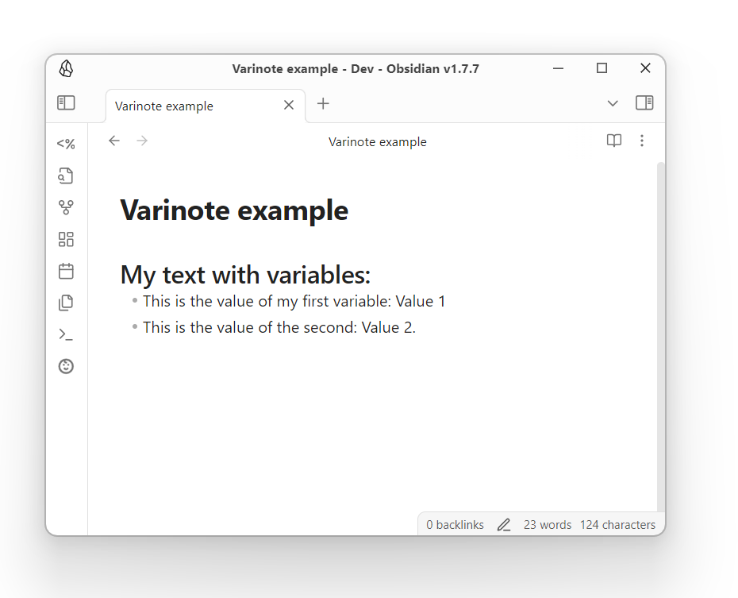

# Varinote (Variables in Notes)

Varinote is a plugin for [Obsidian](https://obsidian.md) that allows you to define variables with optional default values inside your Templates. These variables can then be edited through a modal interface when you add a new note that uses this template.

👉 Create a template

👉 Set the variables using a simple syntax
 
👉 Reference the variables in your template's content
 
👉 Add a new note from this template

👉 Set the variable values in the prompt

✔️ Done! Your note has been updated!


## Basic Usage
* Create a new template, and define your variables using the following syntax:

````markdown
```varinote

variable::Label

```
````
If you want to pass a default value to your field, you can do so like that:

````markdown
```varinote

variable::Label|Default

```
````

* Then, call the variables in your template's content using the `{{$variable}}` syntax. 

For example, assuming that you have the following template:

````markdown
```varinote

var_1:: Label 1|Value 1
var_2:: Label 2

```

## My text with variables:

* This is the value of my first variable: {{$var_1}}
* This is the value of the second: {{$var_2}}.

````
When you create a new note that uses this template, you should see the following prompt:


There, you can set the values for your variables or keep their defaults. Upon save, the Note will be updated. Don't worry, the block that sets the variables will not be carried over to the template, and your note will be clean, containing only the actual content that was intended to display:



Assigning [Templates](https://help.obsidian.md/Plugins/Templates) to Notes can be done using plugins like [Daily notes](https://help.obsidian.md/Plugins/Daily+notes) or [Templater](https://github.com/SilentVoid13/Templater). If you insert a template into an existing Note (e.g. via Templater), you can open the [Command Palette](https://help.obsidian.md/Plugins/Command+palette) and find the `Varinote:` command. 


Selecting it, and assuming that the template includes a valid `Varinote` block, will set the note's variables.

## Advanced usage
The plugin supports the following fields:

### Text field
The simplest field, which requires the simplest possible syntax. You set it with `{name}::{Label}|{Default}`, and you get it with `{{$variable}}`.

### Dropdown
A dropdown with predefined options. You set it with `{name}|dropdown::{Label}|{Default}` (example: `variable|dropdown::My Dropdown|Option 1,Option 2,Option 3`) and get it with `{{$variable}}`.

### Toggle
A true/false toggler which allows you to set different values based on the user's selection. You set it with `{name}|toggle::{Label}|{Default}` (example: `variable|toggle::My toggle|true`).

To use it in your content, you should call it like this: `{{$var::Option if true,Option if false}}`. For example, `{{variable::Yes,No}}` would output "Yes" if the toggle is checked, and "No" if it is unchecked. 

### Slider
A slider which allows you to select a number from a predefined range. You set it with `{name}|slider::{Label}|{min},{max},{step},{default}`. `min` is the minimum value of the slider, `max` is the maximum, `step` determines how much it will jump with each change, and `default` is the default value when the slider loads. For example, a slider with `variable|slider::My Slider|1,100,10,50` would create a slider which can go as low as 1 and as high as 100, moves by 10 with every change, and is preset to 50. 

You can retrieve its value with `{{$variable}}`. 

### Calculations
The syntax supports basic calculations with its Text Field and Slider. To do so, all you have to do is to do the calculation in your variable call. For example, if your variable is set to 10, and you use `{{$variable + 10}}`, it would print "20". 

Of course, for this to work, you need to type a valid number in the text field. 

## Full example
Here is a full example, demonstrating all the above:

### Template

````markdown
```varinote
number_of_people|slider::Number of people|1,10,1,2
difficulty|dropdown::Difficulty level|Easy,Medium,Hard,Expert
boiling_time|toggle::Are the eggs large?|false
greeting::Greeting|Bon appetit!
```
## How to boil an egg for {{$number_of_people}} persons

**Difficulty level: {{$difficulty}}**

This is a very complicated recipe, so pay close attention.
* Take **{{$number_of_people * 2}}** eggs.
* Boil them for **{{$boiling_time::12,10}} minutes**.
* Enjoy.
If they are still raw, it's because you forgot to turn the heat on.

***{{$greeting}}***

🥚🥚

````
### Prompt


### Result


## How to install

1. Downlaod `main.js`, `styles.css`, `manifest.json` files from the [latest release](https://github.com/gsarig/obsidian-varinote/releases).
2. Create new folder inside your vault's `/.obsidian/plugins/` named  `varinote` . If plugins folder doesn't exist, then create it manually. 
3. Move downloaded files into the `/varinote` folder. 
4. Enable the plugin in ObsidianMD. 

## Feedback and Support

If you encounter any issues or have questions, feel free to reach out via the plugin's [GitHub repository](https://github.com/gsarig/obsidian-varinote/).
